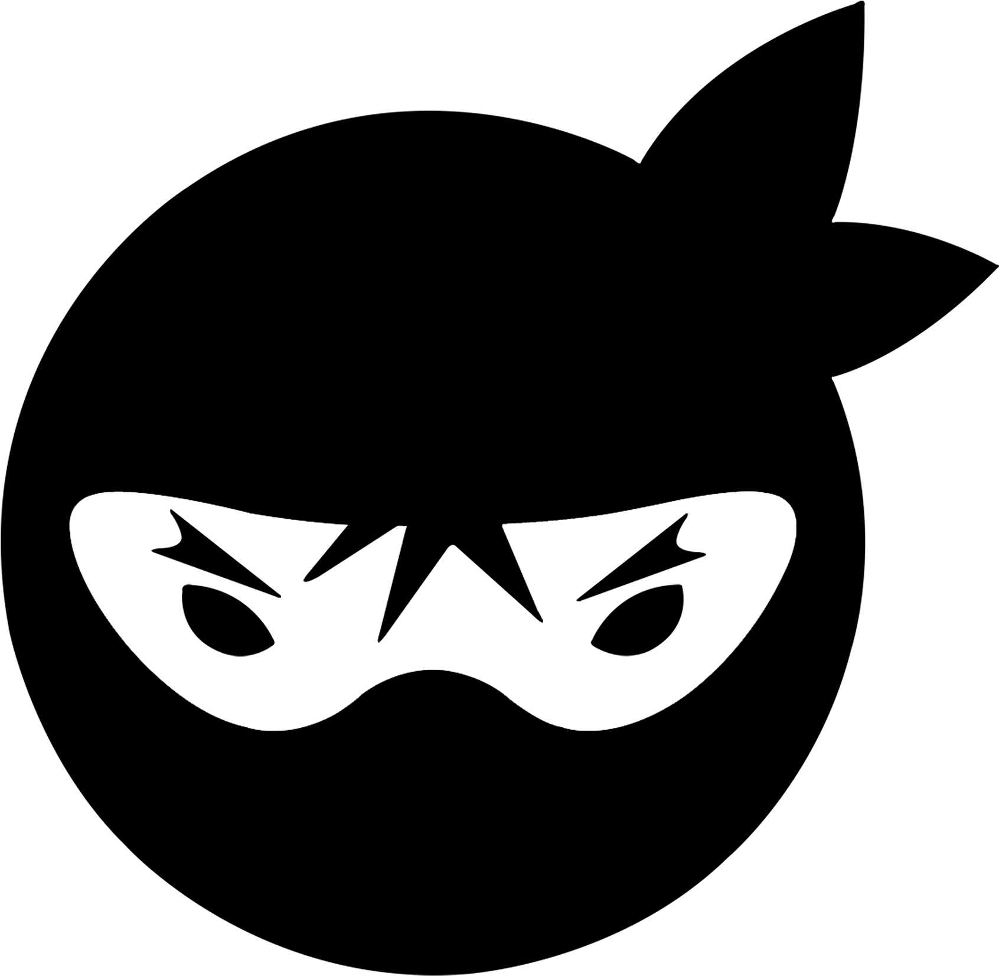

# LabeNinjas 

O projeto Labeninjas foi desenvolvido para dois tipos de pessoas: aquelas que querem oferecer algum tipo de serviço e aquelas que buscam algum tipo de serviço. No LabeNinjas é possível encontrar profissionais capacitados para realizar as mais diversas tarefas. Já se você está precisando de uma grana extra, pode cadastrar o seu serviço de forma detalhada, especificando o valor cobrado, formas de pagamento e prazo para realizar o serviço.

Como o próprio slogan diz, no LabeNinjas você encontra _o melhor serviço, na velocidade de um ninja_.

## Link de acesso

https://labeninjas-grupo5.surge.sh/

## Desenvolvedores

Caíque Souto Lima, Eunice Jesus Souza, Ingrid Erci Flack da Silva, Israel Martins Cordeiro e Luan Dos Santos Melo.

## Tecnologias utilizadas

- ReactJS
- Styled Components

## Funcionalidades

- O usuário pode criar um card oferecendo o seu serviço, estipulando um determinado preço, método(s) de pagamento(s) e prazo para realização.

- O usuário pode ver uma lista de serviços oferecidos.

- O usuário pode filtrar a lista e serviços oferecidos por nome, valor mínimo e/ou máximo e ordenar por título, prazo, preço crescente ou decrescente.

- O usuário pode interagir com o carrinho de compras, deletando ítens e atualizando a página sem perder os ítens já adicionados.

- O projeto é responsivo para tablets e smartphones.

## Status do projeto

Concluído ✅

## Imagens
